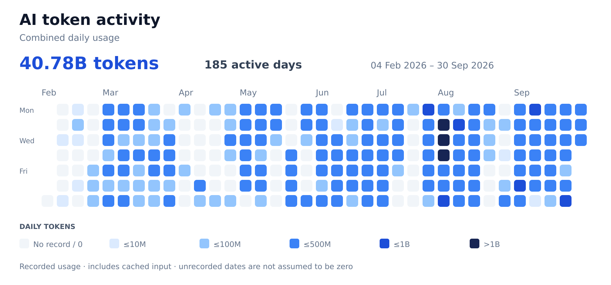

# Reconstructable AI-assisted engineering history

Four separate Projects preserve distinct work. MyScoutee system repositories share one Project; the legacy archive, e-kozig and math each have their own.

| Project | Tasks | Tokens (M), estimated | Allocated activity (h) | API equivalent (USD), estimated |
| --- | ---: | ---: | ---: | ---: |
| [MyScoutee](https://github.com/users/fssrepository/projects/2) | 111 | 36,285.0 | 890.9 | $26,863 |
| [MyScoutee Old](https://github.com/users/fssrepository/projects/3) | 6 | 3.4 | 0.2 AI; manual unknown | $5 |
| [E-Kozig](https://github.com/users/fssrepository/projects/4) | 16 | 457.8 | 9.5 | $260 |
| [Millennium Math Problems](https://github.com/users/fssrepository/projects/5) | 18 | 1,286.0 | 43.5 | $728 |

Estimated token allocation across listed AI work: **38,032,141,411**. The measured usage inventory below is a separate control total, not an amount to add to project budgets. Activity time includes tool/network waits; it is not human labor time. Legacy manual effort is unknown and excluded from numeric totals. USD is a standardized API list-price comparison, not a subscription invoice or amount paid.

The original reconstruction covered 11 source repositories and 226 consolidated source commits. The tracker now contains 151 tasks, including subsequent work. The task issue records share this public tracker for stable references, while their Project boards and totals are separate. Source repository visibility is unchanged.

## Latest completed work

[MSC-113: Granular profile ratings, fractional affinity and v1.3.3 release](https://github.com/fssrepository/myscoutee-roadmap/issues/151)
is complete. Home/Activities UI and rate sync/save/reload are verified. Two
images are deployed to Netcup; migration011 uses the shared DEB migration chain.
No DEB was built. All eight containers are healthy; six retained their identity.
Measured work through 2026-10-01T02:49:50.004Z: **28,648,921 tokens**, **1.369555 h**,
**$42.63 estimated Standard API equivalent**, gpt-6-astra / xhigh and high.
Includes implementation, QA, commits, migration, packaging, deployment and the
verifier follow-up (3/3 regressions and13/13 public checks). Final
accounting writes after cutoff cannot be self-counted. The October-1 task is
counted once; the historical account control and September-30 heatmap stay frozen.

## Measured token activity

**40,781,240,381 tokens** in the combined daily record, through September 30, 2026. Darker blues indicate higher daily usage.

[SVG](guides/project-history/media/token-activity.svg) · [PNG](guides/project-history/media/token-activity.png) · [Anonymous daily totals](guides/project-history/account-coverage.json) · [Regenerate the chart](guides/project-history/HEATMAP.md)

This measured usage total is separate from the estimated task allocation above. Additional measurements may already overlap local task evidence, so they are not added again to task budgets, activity hours or API-equivalent costs. The chart uses combined daily totals. Supporting JSON preserves the input series using account-name initials only; full account identifiers are not published.

## Restore from Git

- [myscoutee backup](guides/project-history/myscoutee/README.md)
- [myscoutee-old backup](guides/project-history/myscoutee-old/README.md)
- [e-kozig backup](guides/project-history/e-kozig/README.md)
- [math backup](guides/project-history/math/README.md)

Each source repository also has a `guides/project-history/` snapshot. Complete per-Project snapshots here and compact repository-specific copies preserve issue bodies, fields, values, view definitions, token/model/time ledgers, attribution assumptions and commit mappings. No chat history is needed. Git records versions; no date-named folder is used.

## Measurement method

- Local active and archived `.codex` histories are the primary execution evidence. All 649 JSONL files were inventoried, including split conversations; the history database was checked for additional coverage. Local retained conversations start on July 22, while account daily records reach February 4.
- Reuse the existing production audit method: unique response IDs when available; positive cumulative-counter differences for older records; unchanged counters contribute nothing; an initial partial counter or reset contributes only its recorded last response. Approval-review histories are not counted as extra user work. Cached input is inside input; reasoning output is inside output.
- Reuse the frozen September 12 film/book audit without changing its 14 phase totals: **2.295 billion logged tokens**, including the separately identified product campaign. Its cutoff excludes that audit's own work. Those tokens are reserved before allocating other account activity, so they are not counted twice.
- For other tasks, date/topic evidence from original commits and conversation requests supplies allocation weights. The daily account totals are control totals. Task splits remain estimates, particularly for mixed conversations and work before local history retention. Unrelated or unsupported activity remains unassigned. 189.2 M tokens for tasks without isolated daily evidence are comparable-task estimates reserved from the unassigned account balance; their daily attribution is unavailable.
- Active time follows the existing audit's union of recorded task intervals, so overlapping root intervals are not added twice. It includes tool execution and waiting within active tasks and is not a human timesheet. Missing AI timing is estimated from comparable observed work. Manual legacy work has no time estimate; archive dates do not establish its original development period. Frozen creative tasks also retain their 15–30 minute joint-window estimates.
- Historical start/finish fields describe when the work happened. GitHub issue creation/closure dates describe this retrospective import. A historical Done record is evidence of delivered work, not a claim that the current software was retested during import.
- Logged model/effort values take precedence. When missing, the creator's stated preference for the strongest available Codex model is combined with release dates: GPT-5.3-Codex from February 5, GPT-5.4 from March 5, GPT-5.5 from April 23, GPT-5.6 Sol from July 9, GPT-6 Astra from September 3. These are explicitly estimated selections; quota-driven fallbacks and rollout timing may differ. Missing reasoning effort remains unrecorded.
- USD estimates use [OpenAI's Standard API rates](https://developers.openai.com/api/docs/pricing), valued on 2026-10-01, for input, cached input, cache writes when observed, and output. Missing token mix is estimated from observed sessions. This standardized short-context comparison excludes Fast/Ultrafast, long-context and regional uplifts, subscription charging, infrastructure, and image/video/TTS-provider credits. It is not historical billing reconciliation.

Model date sources: [GPT-5.3-Codex](https://openai.com/index/introducing-gpt-5-3-codex/), [GPT-5.4](https://openai.com/index/introducing-gpt-5-4/), [GPT-5.5](https://openai.com/index/introducing-gpt-5-5/), [GPT-5.6](https://openai.com/index/gpt-5-6/), [GPT-6 Astra](https://openai.com/index/safety-overview-gpt-6-astra/).

- Four independent Projects separate MyScoutee, the manually developed legacy archive, e-kozig and mathematical research. Shared account tokens are allocated once across all four; a Project total is never an additional account total. Historical legacy AI usage is unverified and left blank. The current AI-assisted Project-administration task is measured separately. A final shared maintenance-run measurement is apportioned by snapshot ownership; its overlap with MSC-108 is removed and its net allocation uses the unassigned account allowance, without exact daily billing reconciliation.
- Mathematical experiments and videos do not establish a solution of the continuous Navier–Stokes problem. The claim withdrawal is a first-class task.

- Combined daily usage is published as anonymous totals only. The original task calibration remains separate: additional measurements may overlap existing task evidence and are not automatically added to task tokens, hours or costs.

## Reconstruction tools

The [history helper archive](guides/history-tools/README.md) preserves the source scripts and workflow notes used for the reconstruction. It excludes backup bundles, credentials and private conversation extracts.

## Task identifiers

MSC, OLD, EKO and MATH IDs are stable task identifiers. Commit bodies link their actual issue numbers; task ID numbers need not equal GitHub issue numbers. Mixed commits retain their contents and can refer to several tasks. Release/archive tags retain their original targets.
